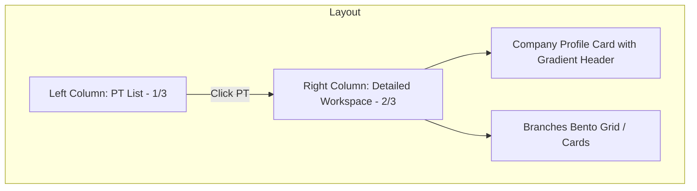
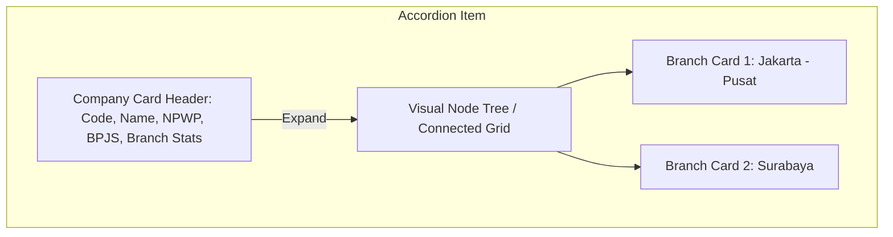
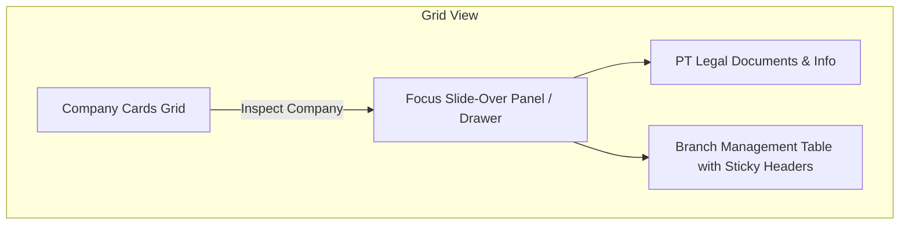

# Design Proposals: Premium Organization Settings UI

Dokumen ini berisi 3 usulan desain layout modern, premium, dan stylish untuk modul **Organization (Company & Branch)**, memecahkan tampilan kaku "AI-generik" dengan pola visual yang interaktif dan berkelas enterprise (SaaS modern).

---

## 1. Opsi A: Bento Split-Workspace (Split Panel Layout)
*Pola Layout dua kolom terbelah (Split Workspace) yang dinamis, terinspirasi dari antarmuka tools modern seperti Linear dan Stripe.*

### Karakteristik Visual & Flow:
* **Left Sidebar (PT List):** Menampilkan daftar perusahaan dalam format kartu vertikal yang compact. Setiap kartu memiliki indikator visual yang halus (glowing left border) ketika terpilih (`active`).
* **Right Panel (Workspace):** Begitu PT diklik, panel kanan memuat detail lengkap. Tidak ada tabel kaku; melainkan area terstruktur yang terdiri dari:
  * **Header Profil PT:** Menggunakan warna background gradient lembut dengan efek glassmorphism (`backdrop-blur-md`).
  * **Branches Bento Grid:** Cabang-cabang tidak ditabelkan, melainkan disusun sebagai **Bento Cards** kecil berisi nama cabang, kota, badge khusus untuk kantor pusat (`is_main`), dan quick-action menu.
* **Aesthetics:**
  * Clean borders (`border-slate-100/80`), bayangan lembut pada hover (`shadow-[0_8px_30px_rgb(0,0,0,0.04)]`).
  * Hover state micro-animation: Kartu bergeser ke atas 2px (`hover:-translate-y-0.5 transition-transform`).

---

## 2. Opsi B: Double-Layered Accordion with Modern Hierarchy
*Menggunakan struktur accordion yang sudah ada tetapi dirombak total secara estetika, mengedepankan hierarki visual yang tajam dan elemen dekoratif.*

### Karakteristik Visual & Flow:
* **Accordion Header:** Header kartu lebih lebar dan lapang. Dilengkapi dengan icon PT (`lucide:building-2`) dalam lingkaran bergradasi warna brand, status badge yang lebih estetik, dan informasi NPWP/BPJS dengan label icon abu-abu tipis.
* **Visual Node Tree:** Saat dibuka (expand), cabang tidak dirender sebagai tabel datar. Melainkan dihubungkan dengan garis hierarki tipis (vertical node line) ke sekumpulan kartu cabang berukuran sedang:
  * Setiap kartu cabang memiliki background putih bersih, sudut melengkung tajam (`rounded-xl`), dan border tipis.
  * Cabang utama (`is_main`) ditandai dengan badge solid warna brand dan ikon bintang (`lucide:star`).
* **Aesthetics:**
  * Efek border-glow saat di-expand.
  * Transisi buka/tutup menggunakan View Transitions API untuk pergerakan tinggi yang mulus.

---

## 3. Opsi C: Command Board & Focus Slide-Over Drawer
*Desain berfokus pada efisiensi tinggi (high-focus mode) yang sering digunakan pada dashboard SaaS mutakhir (seperti Vercel atau Supabase).*

### Karakteristik Visual & Flow:
* **PT Cards Grid:** Perusahaan ditampilkan sebagai grid kartu horisontal yang elegan (3 kolom). Masing-masing kartu merangkum nama, kode, jumlah cabang, dan switch status cepat.
* **Slide-Over Panel (Drawer):** Mengklik kartu perusahaan akan memicu panel drawer samping yang meluncur mulus (`slide-over`) dari kanan layar.
  * Seluruh manajemen cabang, form edit PT, dan form tambah cabang dilakukan di dalam drawer ini.
  * Ini memisahkan kebisingan antarmuka (UI noise) sehingga pengguna fokus mengelola satu PT beserta cabang-cabangnya dalam satu panel khusus yang tinggi.
* **Aesthetics:**
  * Backdrop overlay gelap transparan dengan blur tinggi (`bg-black/40 backdrop-blur-xs`).
  * Desain minimalis serba putih dengan aksen abu-abu kontras tinggi untuk dark mode.
